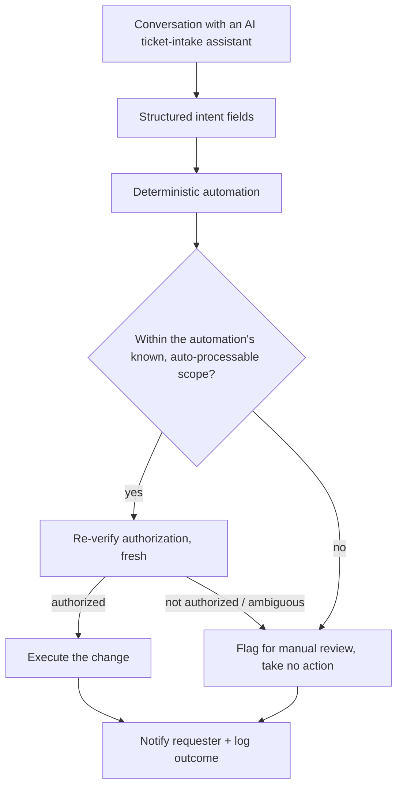

# Conversational Self-Service Automation

Lets people request common IT changes in plain language through a
conversational AI ticket-intake assistant, and have a deterministic
automation actually carry them out — provisioning a tenant, granting a
license, managing an out-of-office message, adding a user with the right
permissions — instead of a technician doing each one by hand.

## The problem

A conversational AI assistant is good at understanding *what* someone is
asking for in a support ticket. It is not, by itself, a safe way to
*execute* that request — "the assistant understood this" and "this
should actually happen, to this system, for this person, right now" are
different questions. Treating the assistant's understanding as
authorization would mean anyone who can word a request convincingly gets
whatever they ask for. The two have to stay separate: the assistant turns
a conversation into a structured request, and a conventional, auditable
automation decides whether and how to fulfill it.

## What it does

- **Structured intent extraction drives a deterministic workflow** — the
  assistant turns a free-form conversation into a fixed set of typed
  fields (who's asking, who or what the request affects, which specific
  option was chosen), and everything downstream is ordinary,
  predictable automation logic operating on those fields — not the AI
  itself performing the action. See
  [concepts/structured-intent-extraction.md](./concepts/structured-intent-extraction.md).
- **Constrained auto-processing, with an explicit escape hatch** — each
  automation only ever auto-processes a small, known set of request
  variants; anything outside that set is routed to a flagged
  manual-review note instead of being attempted. See
  [concepts/constrained-auto-processing.md](./concepts/constrained-auto-processing.md).
- **Progressive status narration** — the requester and the ticket both
  hear from the automation at least twice: once when it starts, and once
  with the outcome, so an AI-driven backend process doesn't look like
  silence to the person waiting on it. See
  [concepts/progressive-status-narration.md](./concepts/progressive-status-narration.md).
- **The same authorization machinery as [AI-Assisted Admin
  Actions](../../security-and-access-control/ai-assisted-admin-actions)**
  — every one of these automations re-verifies who's allowed to do what,
  fresh, at execution time, and hard-stops on anything ambiguous, rather
  than trusting the request at face value.

## Automations built on this pattern

- [Tenant provisioning](./automations/tenant-provisioning.md) — creates a
  new managed-tenant record in the endpoint management platform, gated on
  the submitter's admin role and the parent tenant actually existing.
- [License request with approval routing](./automations/license-request-with-approval-routing.md) —
  grants one of a small set of pre-approved software licenses, routed
  through the requester's actual approver rather than a self-declared
  one.
- [Out-of-office management](./automations/out-of-office-management.md) —
  sets, schedules, or clears a mailbox auto-reply, gated on the submitter
  being the mailbox owner or their verified manager.
- [User provisioning with role assignment](./automations/user-provisioning-with-rbac.md) —
  adds a user to the endpoint management platform and assigns a
  permission group, with hard stops for anything outside a known set of
  roles.

## How it flows

