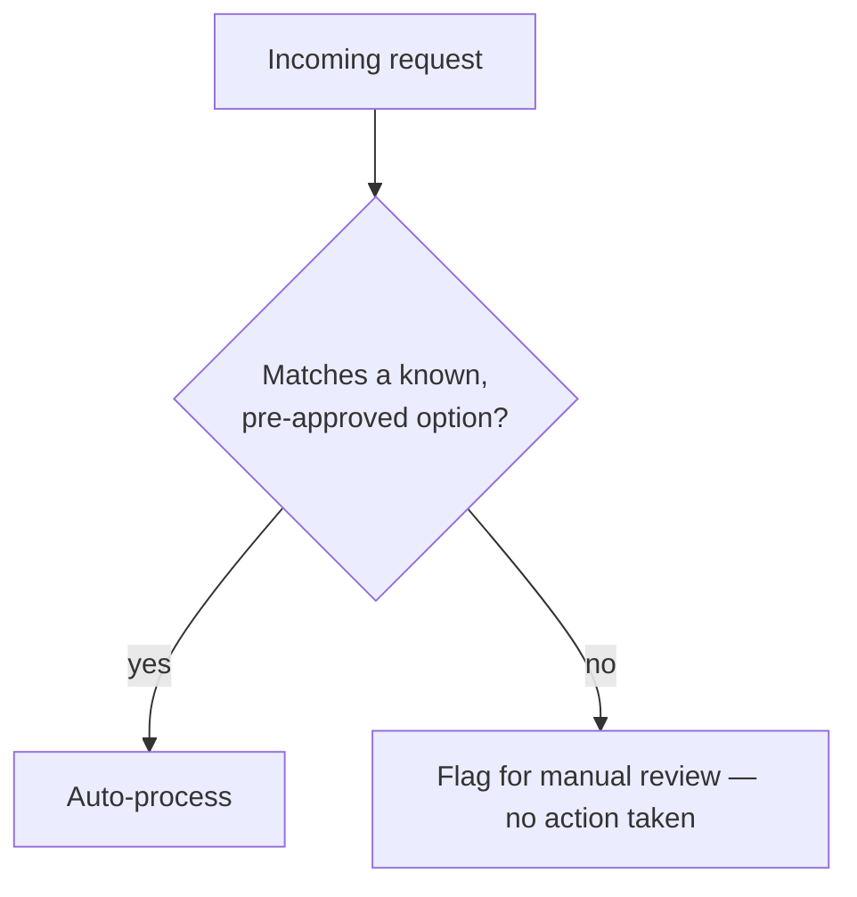

# Constrained auto-processing, with an explicit escape hatch

**The idea:** each automation only knows how to safely handle a small,
explicitly known set of request variants — a handful of software
licenses, a couple of permission tiers. Anything outside that set doesn't
get a best-effort attempt; it gets routed straight to a flagged
manual-review note, with no action taken.

## Why a narrow allowlist instead of general-purpose handling

A request that falls slightly outside what the automation was built to
handle is exactly the kind of case where a best-effort guess is most
likely to be wrong — and wrong in a privileged system is worse than slow.
Limiting auto-processing to a short, explicit list of known-safe options
means the automation only ever acts where it's been deliberately scoped
to, and every other case defaults to a human looking at it, rather than
the automation improvising.

## Design principles

- **The allowlist is small and explicit**, not inferred from patterns in
  past requests — new options get added deliberately, not learned.
- **Falling outside the list is a normal, expected outcome**, not an
  error. The manual-review note is a designed path, not a fallback for
  something going wrong.
- **The list can grow without changing the gate.** Adding a newly
  supported option means adding it to the list, not rewriting the
  decision logic that checks against it.
