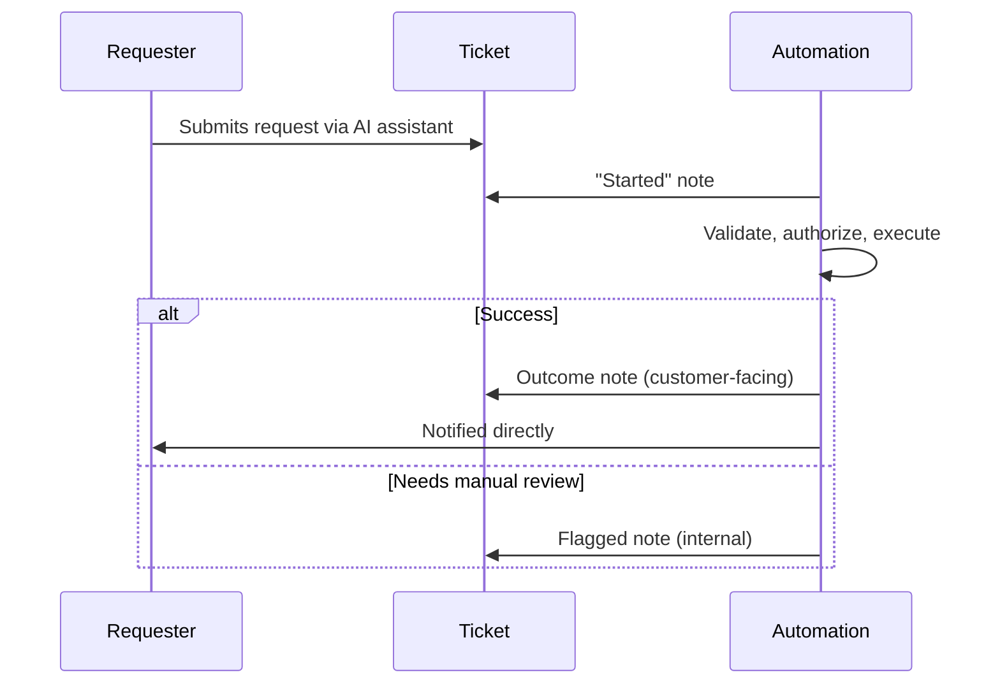

# Progressive status narration

**The idea:** the requester and the ticket both hear from the automation
at more than one point — a note when the automation starts working the
request, and another when it finishes, whatever the outcome. An
AI-driven backend process shouldn't look like silence followed by a
sudden result to the person who asked for it.

## Why narrate progress instead of just posting a final result

A request that appears to do nothing for a while, then either succeeds or
silently needs a human, reads the same as a system that's stuck or
ignored the request. Posting a note the moment work begins gives the
requester (and anyone else watching the ticket) confirmation that the
request was received and is actually being acted on, independent of how
long the rest of the automation takes.

## Design principles

- **Every path ends in a note, including the ones that stop early.**
  Whether the outcome is success, a hard stop, or a manual-review flag,
  the ticket always reflects the current, accurate state — never left
  hanging on "started."
- **Not every note is customer-facing.** A started note or a
  manual-review flag can stay internal, while a completed action gets a
  note the customer actually sees — visibility is calibrated to who
  needs to know what.
- **Narration and execution are separate concerns.** Posting a note
  never substitutes for actually checking authorization or executing the
  change; it runs alongside the real logic, not instead of it.
