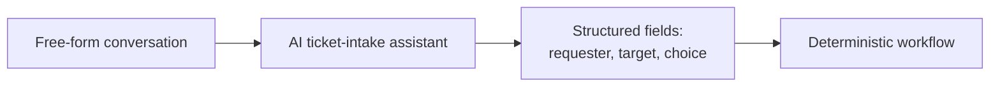

# Structured intent extraction

**The idea:** a conversational AI assistant's real job is translation —
turning a free-form request into a small, fixed set of typed fields (who's
asking, who or what is affected, which specific option was picked).
Everything after that point is ordinary automation logic acting on those
fields; the AI itself never performs the action.

## Why translate instead of letting the assistant act directly

An AI assistant reasoning in natural language is flexible but not
naturally auditable or repeatable — the same request phrased two
different ways could otherwise produce two different code paths.
Extracting a fixed set of fields collapses that variability at the
boundary: however the request was phrased, the automation downstream only
ever sees the same small, known shape of input, and behaves identically
for identical intent.

## Design principles

- **The handoff point is a contract, not a conversation.** Once intent is
  extracted, the workflow doesn't re-interpret anything — it operates on
  fields with known names and known meanings.
- **The AI's job ends at understanding.** Deciding whether the request is
  allowed, and carrying it out, both happen entirely in conventional,
  inspectable automation logic.
- **This is what makes the rest of the pattern possible.** Constrained
  auto-processing and authorization gating only work because they have a
  small, predictable set of fields to check against — not open-ended
  natural language.
