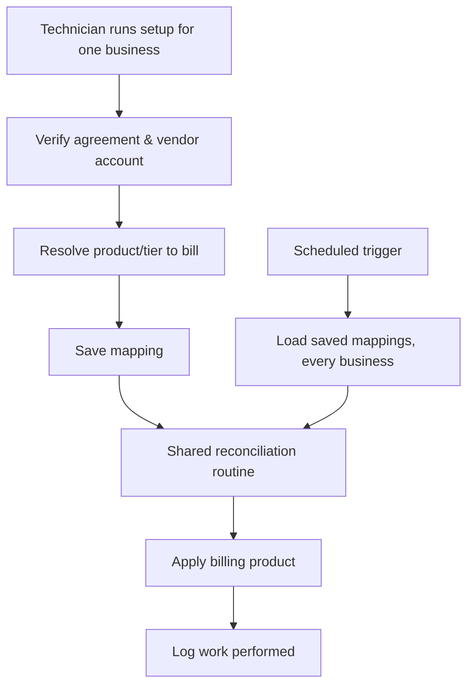
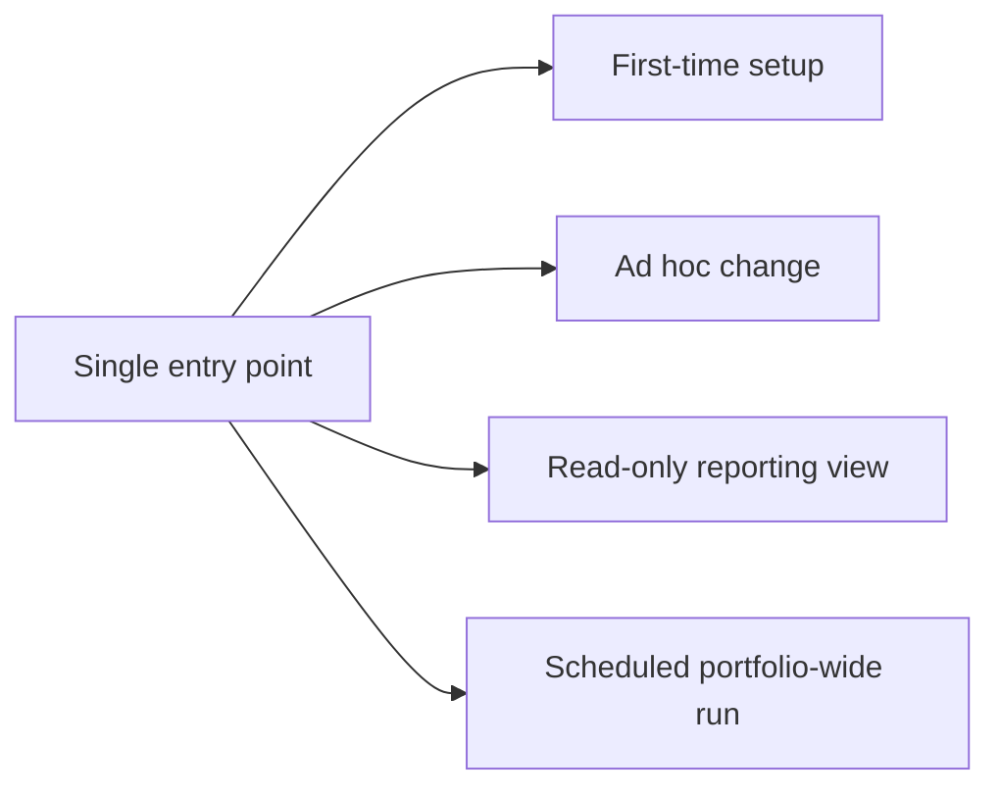

# Per-vendor sync pattern

**The idea:** rather than building a one-off integration for each vendor,
every vendor sync follows the same shape — an interactive **setup** path
that a technician runs once per business, and a **scheduled** path that
re-runs the same underlying logic across the whole portfolio on a
recurring basis. Both paths converge on one shared routine, so there's
exactly one implementation of "how to reconcile this vendor," whether it's
triggered once or on a schedule.

## The shared shape

1. **Setup** — given the billing agreement and the vendor account to
   connect, verify the pieces exist, resolve the correct product/tier to
   bill (sometimes read live from the vendor rather than fixed once and
   forgotten), apply it, and save the resulting mapping so future runs
   know what belongs to what.
2. **Scheduled sync** — on a recurring cadence, read every business's
   saved mapping and re-run the same reconciliation logic in bulk, so
   billing stays correct as usage or licensing changes over time without
   requiring setup to be re-run manually.
3. **Work is tracked, not silent** — both paths log their own activity
   (what changed, for whom) so the automation's effect is auditable rather
   than invisible.

## Variations on the pattern

- Some vendors bill as a single combined line item; others need the
  mapping split by device or user class. The pattern accommodates either
  without changing the setup/schedule split.
- Where a vendor's billing depends on a value that changes over time (like
  a license tier), that value is read fresh at sync time rather than
  cached from setup, so billing tracks reality even if nobody re-runs
  setup.
- One integration (a directory-driven user sync) extends the pattern with
  a routing layer: the same entry point serves first-time setup, ad hoc
  changes, a read-only reporting view, and the scheduled portfolio-wide
  run, based on which inputs are present when it's invoked — one
  implementation instead of four:

## Design principles

- **One implementation of the reconciliation logic**, called by both the
  human-triggered path and the scheduled path — avoids setup and the
  scheduled sync silently drifting apart from each other over time.
- **Mappings are saved, not recomputed from scratch.** Setup is the
  expensive, human-supervised step; the scheduled run is cheap and
  automatic because it trusts what setup already verified.
- **Automation labor is logged, not just executed** — so the time saved by
  automating a task is visible in the same system used to track
  billable/trackable work.
