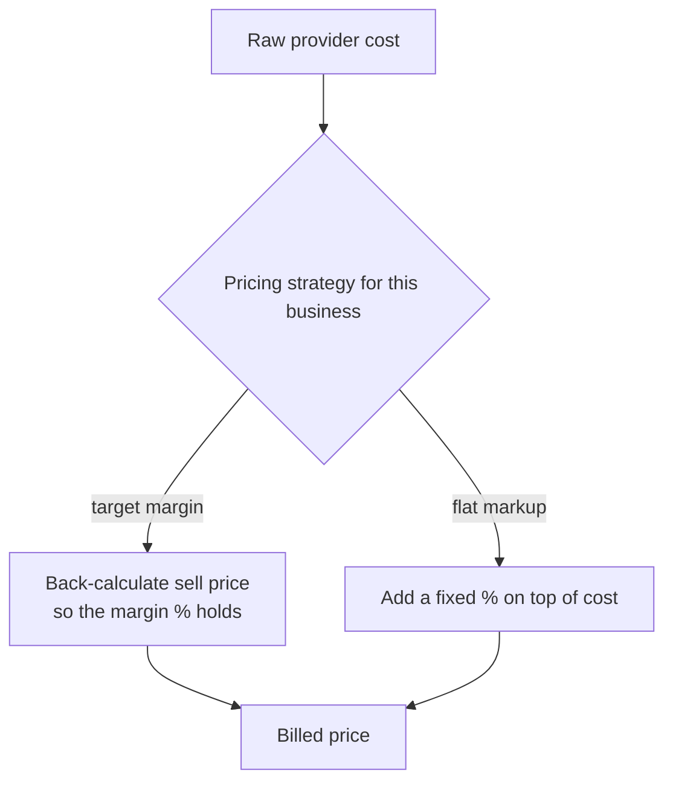

# Configurable cost-to-price translation

**The idea:** what the provider charges and what the customer is billed
aren't the same number, and the formula connecting them can take one of
two different shapes — a target gross margin, or a flat markup — chosen
per business rather than fixed once for everyone.

## Why two formulas instead of one

A margin target and a flat markup answer different questions. "I want to
keep a fixed margin no matter what this costs" and "I always add a fixed
percentage on top of cost" produce different prices at different cost
levels, and different businesses — or different pricing philosophies
within the same business — legitimately want one or the other. Picking a
single formula for everyone would force one pricing philosophy on
businesses that operate the other way.

## Design principles

- **The formula is a per-business setting, not a code branch someone has
  to maintain per customer.** Switching a business between margin and
  markup pricing is a config change.
- **The math is isolated from the rest of the sync.** Whatever formula
  runs, everything downstream just receives "the price to bill" — the
  sync doesn't need to know which strategy produced it.
- **Rounding happens once, at the end of the formula**, so the same cost
  always produces the same billed price rather than accumulating small
  discrepancies from intermediate rounding.
