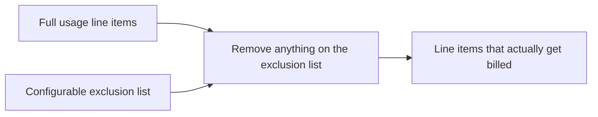

# Exclusion list filtering

**The idea:** some usage line items shouldn't be billed through this
automation at all — maybe they're covered under a different agreement, or
intentionally absorbed. Rather than special-casing those exceptions
inside the sync logic, a configurable exclusion list is diffed against
the full usage export before any pricing math happens, so exceptions live
in config, not code.

## Why a list instead of conditional logic

A hardcoded exception ("skip line items where X") only covers the cases
someone anticipated when writing the automation. A configurable list
covers whatever comes up later — a new product that needs excluding this
period doesn't require a workflow change, just an update to the list.

## Design principles

- **Exceptions are data, not code.** Anyone who manages the billing
  config can add or remove an exclusion without touching the automation.
- **Filtering happens before pricing, not after** — an excluded item never
  factors into the total, rather than being billed and then credited
  back.
- **The comparison technique (a set difference by key) generalizes.** The
  same approach could filter any other list-vs-list exception case, not
  just this one.
