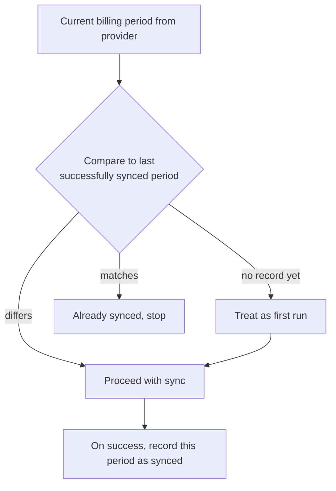

# Period-based idempotent sync

**The idea:** before doing any work, compare the billing period this run
would charge for against the last period the automation actually finished
successfully. If they match, there's nothing to do — stop. Only a
genuinely new period triggers a real sync, so re-running the automation
(on a schedule, or by hand) never double-charges the same period.

## Why compare periods instead of just running on a schedule

A schedule guarantees the automation *starts*, not that it should *act*.
If a run is retried, triggered manually, or simply overlaps with the
previous cycle, a schedule-only trigger would happily bill the same
period again. Checking the actual period against what was last completed
makes the whole operation safe to re-run, which matters more for a
billing action than almost anything else in the system.

## Design principles

- **The record of "what's synced" is the source of truth**, not the
  schedule. The automation asks "have I already done this?" before asking
  "should I do this now?"
- **The record only updates after success.** A failed run doesn't mark the
  period as done, so a genuine failure gets retried on the next trigger
  rather than being silently skipped forever.
- **Safe to re-run by construction.** Because the check happens before any
  billing action, triggering the automation twice for the same period is
  harmless rather than something that has to be avoided operationally.
