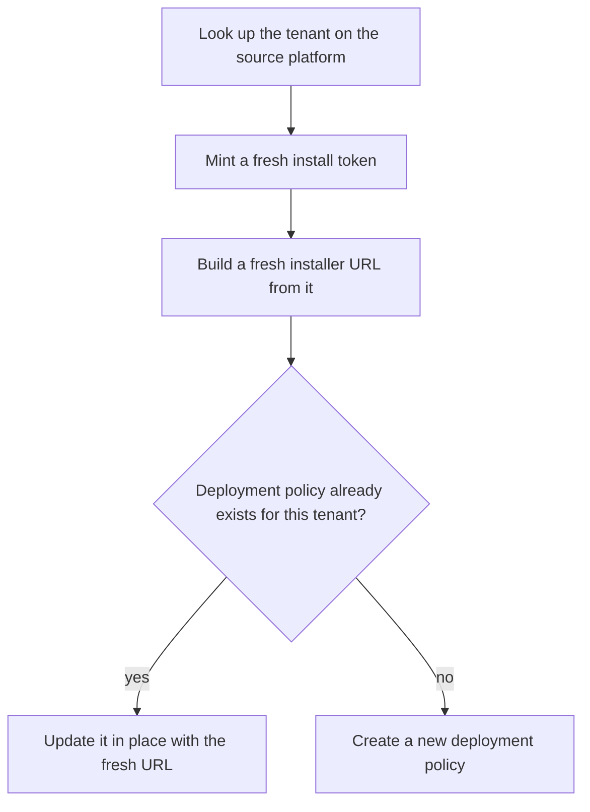

# Tenant Agent Auto-Provisioning

Keeps every managed tenant's endpoint agent deployment policy current
automatically — including the install credential embedded in it —
instead of a technician generating an installer link and configuring the
deployment by hand, and remembering to redo it whenever that credential
would otherwise go stale.

## The problem

An agent installer link usually carries a token that's specific to a
moment in time. If that token gets baked into a deployment policy once
and never refreshed, the policy quietly stops working whenever the token
expires or rotates — and nobody finds out until a new device fails to
enroll. Multiply that across every managed tenant and it's not a
one-time setup task, it's an ongoing maintenance burden that's easy to
forget.

## What it does

- **Freshly minted installer credentials, every run** — rather than
  storing a static installer link, the automation asks the source
  platform for a brand-new install token each time it runs and builds a
  fresh installer URL from it, so whatever's embedded in the deployment
  policy is never older than the automation's last run. See
  [concepts/freshly-minted-install-credentials.md](./concepts/freshly-minted-install-credentials.md).
- **Idempotent create-or-update, keyed by tenant** — before doing
  anything, the automation checks whether this tenant already has a
  deployment policy on record; if so, it updates that record in place
  with the fresh credential instead of creating a duplicate, and if not,
  it creates one from scratch. See
  [concepts/idempotent-deployment-upsert.md](./concepts/idempotent-deployment-upsert.md).

## How it flows

