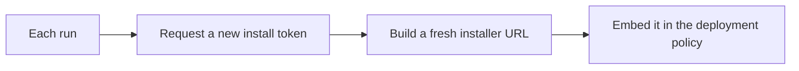

# Freshly minted install credentials

**The idea:** rather than generating an installer link once and reusing
it indefinitely, the automation asks the source platform for a
brand-new install token on every run, and builds the installer URL fresh
from whatever comes back. The deployment policy always carries a
credential that's as current as the automation's last run, never one
generated once and left to go stale.

## Why not generate the link once and store it

A token generated once has a shelf life determined by the source
platform, not by how long the deployment policy using it will be around.
Storing it once means the policy silently breaks the moment that token
expires or rotates, with no natural trigger to notice — the first sign of
trouble is usually a new device failing to enroll. Re-minting it on every
run removes the shelf life from the equation entirely: the credential in
the policy is only ever as old as the last time the automation ran.

## Design principles

- **The credential is a byproduct of the run, not a stored secret.**
  Nothing about this workflow depends on remembering or rotating a saved
  token — it simply asks fresh every time.
- **The installer URL is assembled, not looked up.** Because it's built
  from a small set of live values (a token plus identifying details for
  the tenant) rather than fetched as a single opaque value, the
  automation stays resilient to the token's format changing shape, as
  long as the pieces it's assembled from still mean the same thing.
- **Re-running this automation is itself the maintenance.** There's no
  separate "renew the token" task — running the same automation again on
  a schedule is what keeps the credential from going stale.
