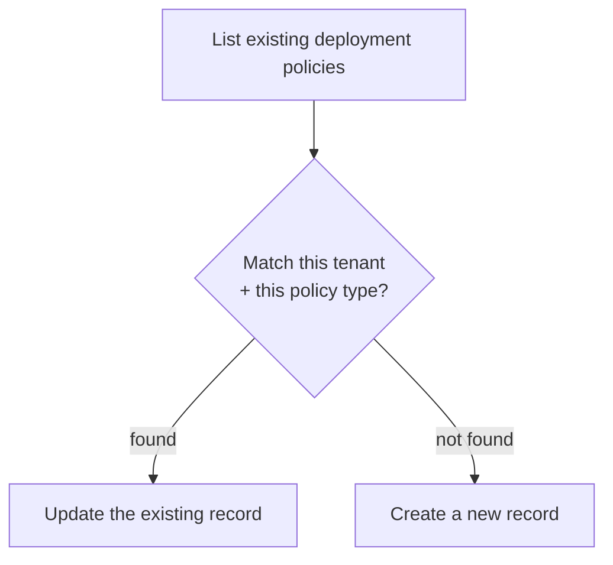

# Idempotent deployment upsert

**The idea:** before creating anything, check whether a deployment policy
already exists for this tenant. If it does, update it in place with
whatever's changed (the fresh install credential); if it doesn't, create
one from scratch. Running the automation twice for the same tenant never
produces two competing policies.

## Why check first instead of always creating

A deployment policy is meant to be a singleton per tenant — there should
be exactly one governing how a given agent gets installed for that
tenant, not one per time the automation happened to run. Always creating
would produce duplicate, possibly conflicting policies every time the
credential needed refreshing; checking first turns "refresh the
credential" and "set this up for the first time" into the same operation
from the automation's point of view.

## Why match on both the tenant and the policy type

A tenant could reasonably have several different deployment policies for
different purposes. Matching on tenant alone risks updating the wrong
policy; matching on the specific policy type as well as the tenant
ensures the automation only ever touches the one record it's actually
responsible for keeping current.

## Design principles

- **Every failure path in the chain funnels to one place.** Whichever
  step fails — the lookup, the credential mint, the create, or the
  update — the automation records what went wrong and stops the same
  way, rather than needing bespoke failure handling at each step.
- **The same payload shape serves both create and update.** Because
  creating and updating use an identical structure (just a different
  target — a new record versus an existing one's ID), there's one
  definition of "what this deployment policy should look like," not two
  that could drift apart.
- **Safe to re-run on a schedule.** Combined with [freshly minted install
  credentials](./freshly-minted-install-credentials.md), this makes
  "run this again" a complete strategy for keeping every tenant's
  deployment current — no separate update path is needed.
