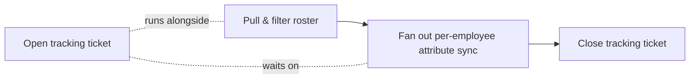

# Workforce-to-Directory Identity Sync

Keeps directory user attributes in sync with the authoritative employee
data held in a workforce management system, so an employee's identity in
the directory reflects HR's source of truth instead of being maintained by
hand in two places.

## The problem

HR-managed employee data (name, employee ID, employment status) and
directory-managed identity data (the user account technicians, apps, and
access all key off of) are two different systems that both claim to
describe "who works here." Left
unsynchronized, one drifts from the other — a name change in HR doesn't
reach the directory, an employee ID used by other integrations goes
missing on the identity side, or a terminated employee's record keeps
being touched by a process that should have stopped.

## What it does

- **HR-driven identity sync** — pulls the current employee roster from
  the workforce system, filters it down to active employees, and pushes
  the relevant attributes to each person's directory account. See
  [concepts/hr-driven-identity-sync.md](./concepts/hr-driven-identity-sync.md).
- **A single ticket wraps the whole run** — one tracking ticket opens
  before the batch starts and closes once every employee has been
  processed, so a scheduled background job is visible and auditable as
  one unit of work instead of one ticket per person, or none at all. See
  [concepts/ticketed-batch-run.md](./concepts/ticketed-batch-run.md).

## How the pieces fit together

