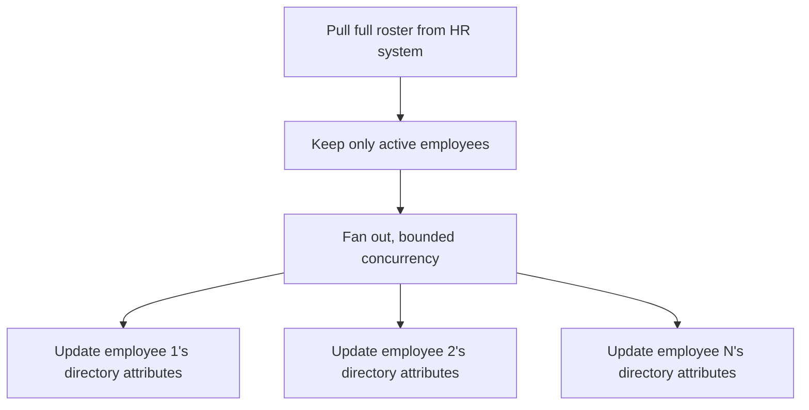

# HR-driven identity sync

**The idea:** the workforce management system is the source of truth for
who's actually employed and what their basic attributes are. Rather than
maintaining those attributes by hand in the directory, a recurring job
reads the current roster from HR, narrows it to people who should still
have an active account touched, and propagates the relevant attributes to
each person's directory identity.

## Why filter before syncing

Not every record HR returns should still be acted on — someone marked
terminated shouldn't have their directory account touched by a routine
attribute sync; offboarding is a separate, more consequential process.
Filtering to the active population before fan-out keeps this sync
narrowly scoped to "keep active employees' identity attributes current,"
rather than overlapping with unrelated lifecycle processes.

## Design principles

- **One direction of truth.** HR data flows to the directory, not the
  other way — the sync exists because the directory shouldn't be the
  place these attributes get edited first.
- **Scoped by employment status, not just existence.** A record showing
  up in the HR export isn't sufficient reason to act on it; the sync only
  touches people who are currently active.
- **Bounded fan-out.** Every active employee is processed independently
  with a concurrency cap, so the job scales to the size of the workforce
  without needing to be restructured as headcount grows.
