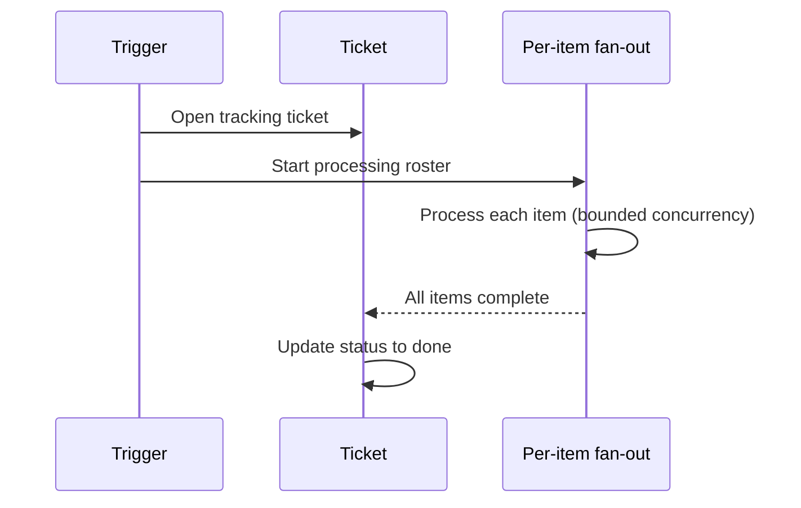

# Ticketed batch run

**The idea:** wrap an entire scheduled batch job — not each item inside
it — in a single tracking ticket. The ticket opens before the fan-out
starts and is updated once every item has finished, giving one auditable
record of "this batch ran, here's when" instead of either silence or a
flood of one ticket per record.

## Why one ticket per run, not per record

A sync touching dozens or hundreds of directory accounts doesn't need
dozens of tickets — that would bury the signal (did the batch succeed?) in
noise (one row per person). A single ticket that opens at the start and
closes at the end gives an operator one place to check run history and
catch a batch that never completed, without generating ticket volume
proportional to headcount.

## Design principles

- **The ticket's lifecycle mirrors the batch's lifecycle** — open at
  start, closed at completion — rather than being a fire-and-forget action
  with no completion signal.
- **Granularity matches what a human needs to review**, not what's
  technically possible to log. One record per run is enough to catch a
  stuck or failed batch; per-item detail belongs in execution logs, not
  ticket volume.
- **The same "track the work, don't run it silently" instinct as the
  [per-vendor sync pattern](../../../billing-and-reconciliation/agreement-sync-platform/concepts/per-vendor-sync-pattern.md)**,
  applied here at the batch level instead of the per-business level.
