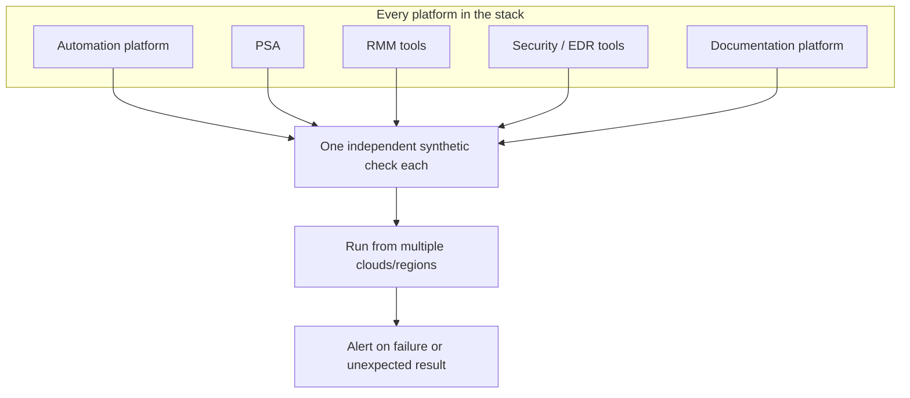

# Cross-Platform Synthetic Monitoring

A portfolio of synthetic checks, one per platform in the toolchain, that
continuously exercises the systems an MSP's own service delivery depends
on — from the outside, the same way a real user or a real automation run
would hit them.

## The problem

An MSP's own tooling is itself a dependency chain: the automation
platform depends on the PSA being reachable, the RMM tools being
reachable, the security tools being reachable, and so on. If any one link
in that chain silently goes down, the first sign is usually a support
ticket or a failed automation run — after the fact, not before. Waiting
for a downstream failure to notice an upstream outage means the outage is
already affecting customers by the time anyone finds out.

## What it does

- **One check per platform, not one check for everything** — every
  platform in the stack gets its own independent synthetic test, so a
  single platform going down is diagnosed immediately as *that* platform,
  not as a vague "something's wrong somewhere." See
  [concepts/one-check-per-platform.md](./concepts/one-check-per-platform.md).
- **Realistic multi-step checks, not just a ping** — several checks walk
  through an actual multi-step sequence (list something, create
  something, confirm it) instead of asking only "did the server
  respond," so a platform that's up but partially broken still gets
  caught. See
  [concepts/realistic-multi-step-checks.md](./concepts/realistic-multi-step-checks.md).
- **Multiple vantage points per check** — the same check runs from
  several different cloud providers and regions at once, so a failure
  can be told apart from a network problem specific to one vantage
  point. See
  [concepts/multi-vantage-point-checks.md](./concepts/multi-vantage-point-checks.md).
- **Parallel monitoring through a platform migration** — when a core
  platform is being migrated to a new engine, both the old and the new
  get their own checks running side by side, so cutover confidence comes
  from evidence, not assumption. See
  [concepts/parallel-monitoring-during-migration.md](./concepts/parallel-monitoring-during-migration.md).
- **Some checks are healthy when they fail correctly** — a check against
  an authentication-gated endpoint can assert on getting the *correct*
  rejection, rather than always expecting success, since the wrong kind
  of response is the real failure mode. See
  [concepts/expected-failure-assertions.md](./concepts/expected-failure-assertions.md).

## How it fits together

This is the same instinct as [Platform Health
Heartbeat](../platform-health-heartbeat) applied across an entire
toolchain instead of one platform: an external check is what actually
proves a system is reachable end to end, not an assumption based on
nothing having broken yet.
