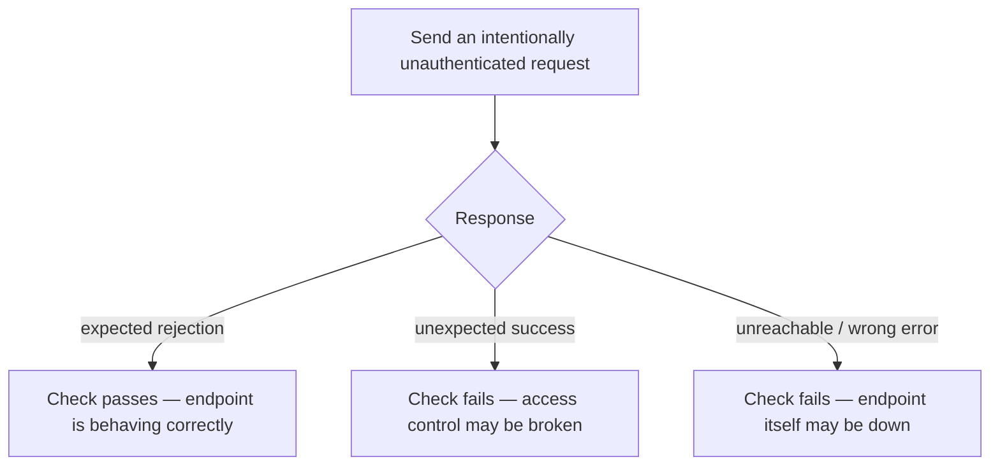

# Expected-failure assertions

**The idea:** not every check should expect a success response. A check
against an endpoint that's supposed to reject unauthenticated requests is
only actually healthy when it does exactly that — so the check asserts
on getting the correct rejection, and would fail if it ever got back an
unexpected success instead.

## Why "it failed correctly" can be the healthy outcome

An endpoint that's supposed to be gated behind authentication has two
ways to be wrong: being unreachable, or letting an unauthenticated
request through when it shouldn't. A check that only ever expects
success can't catch the second failure mode at all — it would report a
security regression as if nothing were wrong. Asserting on the specific
expected rejection catches both: no response (or the wrong kind of
response) means the endpoint is down or misbehaving, while an unexpected
success means something more concerning has changed.

## Design principles

- **The expected outcome is defined by what correct behavior actually
  looks like**, not by a generic assumption that success means healthy.
- **An unexpected success is itself a failure signal** — treating it as
  such is what makes this kind of check catch problems a success-only
  check structurally cannot.
- **This only works because the expected response is specific and
  stable** — asserting on a precise, known rejection, not just "any
  non-2xx," so the check stays meaningful rather than trivially passing.
