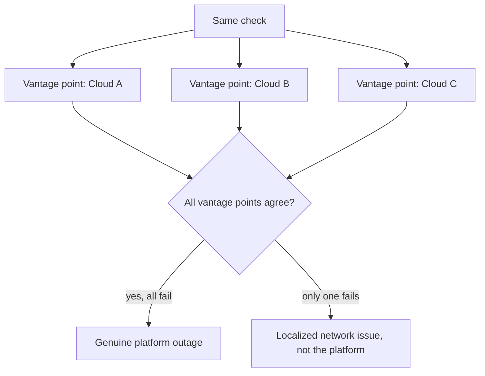

# Multiple vantage points per check

**The idea:** the same check doesn't just run from one place — it runs
from several different cloud providers and regions at once, so a failure
can be told apart from a network problem that's local to a single
vantage point rather than the platform being monitored.

## Why one vantage point isn't enough

A single monitoring location shares its own network path, provider, and
region with whatever's between it and the platform being tested. A check
that only ever runs from one place can't distinguish "the platform is
down" from "something between this one location and the platform is
down" — and chasing the wrong one wastes time during an actual incident.
Running the same check from multiple, independent vantage points turns
that ambiguity into a clear signal: agreement across vantage points means
the problem is real; disagreement points at the network path instead.

## Design principles

- **Vantage points are chosen to be independent of each other** —
  different cloud providers and regions, not just different servers on
  the same network.
- **A single vantage point failing is a lead, not an alert** — it's
  agreement (or disagreement) across vantage points that actually
  determines whether something's genuinely wrong.
- **The same principle scales down to a single critical check** or up to
  an entire portfolio of them — it's a property of how each check runs,
  independent of what it's checking.
