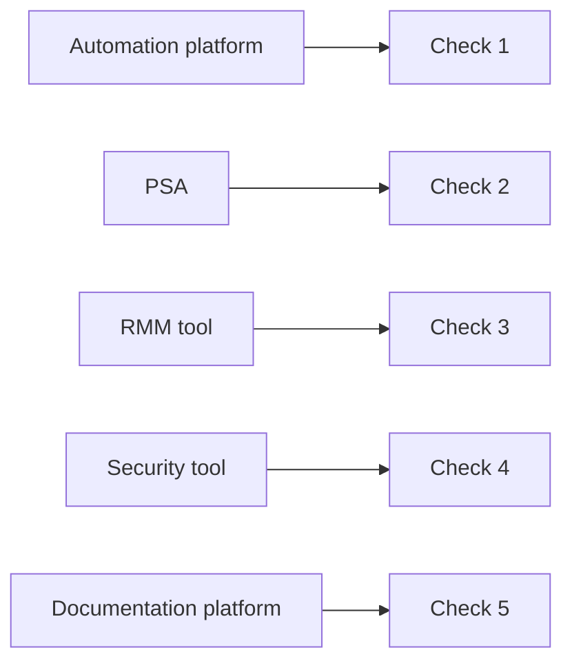

# One check per platform, not one check for everything

**The idea:** rather than a single broad "is the stack healthy" check,
every platform the business's service delivery depends on gets its own
independent, purpose-built synthetic test.

## Why not one umbrella check

A single check that only verifies "the front door is open" can pass while
something several layers deep is actually broken — or fail for a reason
that has nothing to do with the platform anyone actually needs right now.
Splitting checks by platform means a failure notification already
answers "which system," which is most of the work of triage before
anyone's even looked at it.

## Design principles

- **Coverage should mirror the actual dependency map**, not just the
  platforms that are easiest to check. If service delivery depends on
  it, it gets a check.
- **A failing check names its platform by construction** — there's no
  ambiguity to resolve after the alert fires, because each check only
  ever represents one system.
- **New platforms get new checks, not changes to existing ones.** Adding
  a tool to the stack means adding a check for it, not folding it into
  something that already tests something else.
