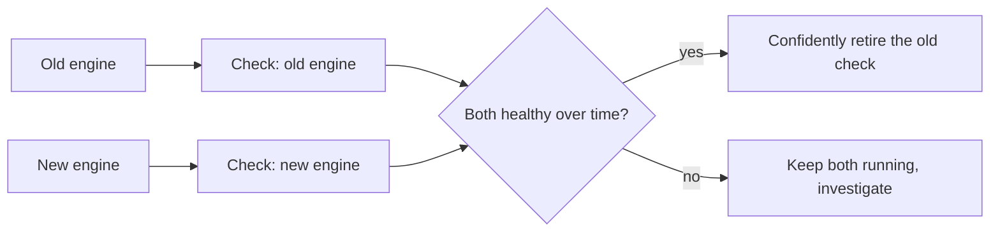

# Parallel monitoring during a platform migration

**The idea:** when a core platform is being migrated to a new engine or
version, both the outgoing and incoming systems get their own synthetic
checks running side by side for the duration of the migration, instead of
monitoring being switched over the moment the new system is nominally
ready.

## Why monitor both instead of cutting over monitoring immediately

A migration being "done" from a configuration standpoint isn't the same
as the new system being proven reliable under real conditions. Removing
monitoring from the old system the moment the new one is nominally live
means losing the ability to compare them, or to fall back with
confidence if the new system turns out to have a problem the old one
didn't. Running both in parallel turns "is the new system actually
ready" into a question answered by accumulated evidence, not a one-time
cutover decision.

## Design principles

- **The old system isn't assumed obsolete until the data says so.**
  Retiring its check is a decision made from monitoring history, not
  from the migration plan's timeline.
- **Both checks are held to the same standard.** The new system doesn't
  get a lighter check just because it's newer — it has to prove the same
  thing the old one already does.
- **This is a temporary, not permanent, redundancy.** The old check gets
  retired once its job — proving the new system is a safe replacement —
  is done.
