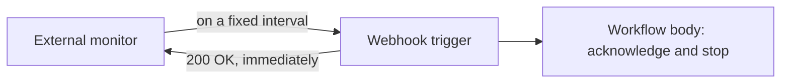

# Platform Health Heartbeat

A synthetic uptime check that doubles as proof the automation platform's
entire trigger pipeline is alive — not just that a server somewhere is
running.

## The problem

Knowing whether an automation platform is "up" isn't just about pinging a
server — what actually matters is whether triggers fire and webhooks get
processed end to end. A basic ping check can pass while the piece that
actually matters, the trigger-to-workflow pipeline, is broken.

## What it does

An external monitoring tool calls a webhook on a fixed interval. The
webhook trigger itself responds successfully the moment it's received —
before any workflow logic even runs — and the workflow body that follows
exists only to acknowledge that the check completed. If the monitoring
tool ever stops seeing a successful response, that's a signal the
platform's own trigger pipeline, not just the server behind it, has a
problem.

## How it flows

## Design principles

- **The response comes from the trigger, not the workflow's own logic.**
  Success means the platform's own dispatch mechanism is healthy, which
  is a stronger signal than "a workflow ran to completion" — a broken
  trigger pipeline would never even reach that point.
- **There's deliberately nothing else to do.** Adding real logic to a
  liveness check risks the check itself becoming a source of failures
  unrelated to what it's meant to verify.
- **The monitoring tool is independent of the platform it's watching**,
  so a platform-wide outage doesn't also take down the thing reporting
  the outage.
