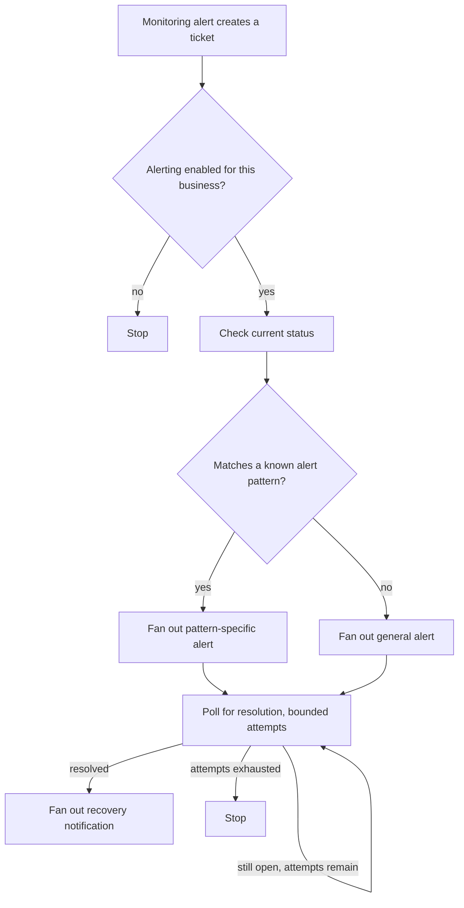

# Real-Time Incident Alerting

A recurring automation that turns a monitoring alert into immediate,
multi-channel notifications — and automatically tells everyone when the
problem clears, without a human having to remember to send the all-clear.

## The problem

A monitoring alert firing at 2 a.m. is only useful if the right people
find out about it right away, through a channel they'll actually notice.
And once it's fixed, someone still has to circle back and tell everyone
it's resolved — a step that's easy to forget when the fix itself was the
priority. Left manual, alerting either under-notifies (people miss it) or
over-notifies (every channel gets paged for everything, all hours), and
recovery notices depend on someone remembering to send them.

## What it does

- **Multi-channel, multi-audience fan-out** — one alert reaches a targeted
  on-call list and a broader stakeholder list by text message, plus a
  shared team channel, each independently configurable. See
  [concepts/multi-channel-fan-out.md](./concepts/multi-channel-fan-out.md).
- **Channel-specific quiet hours** — the urgent, targeted channel fires
  any time; the shared visibility channel only posts during business
  hours, so it doesn't accumulate off-hours noise nobody's there to read.
  See
  [concepts/channel-specific-quiet-hours.md](./concepts/channel-specific-quiet-hours.md).
- **Self-resolving alert loop** — after the initial alert, the automation
  keeps checking the underlying record on a bounded interval and
  automatically fires a recovery notification through the same channels
  the moment it clears. See
  [concepts/self-resolving-alert-loop.md](./concepts/self-resolving-alert-loop.md).
- **Per-business opt-out** — a simple config toggle lets alerting be
  switched off for a specific business without touching the automation
  itself, the same "behavior as data, not code" principle used elsewhere
  in this portfolio.

## How it flows

