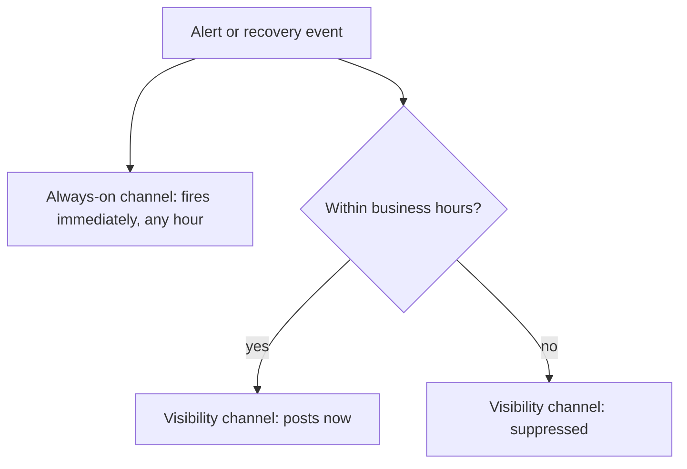

# Channel-specific quiet hours

**The idea:** not every notification channel should behave the same
around the clock. A channel meant for immediate action fires any time,
day or night. A channel meant for visibility — a persistent, shared
record — only fires during hours someone's actually likely to see it, so
it doesn't accumulate off-hours noise nobody's there to read.

## Why gate one channel and not the other

The two channels serve different purposes: one is for someone to act on
right now, regardless of the hour; the other is for anyone to later
confirm what happened. Posting the second one in the middle of the night
doesn't get anyone's attention faster — it just adds clutter to scroll
past the next morning. Gating it to business hours keeps it useful
without losing anything, since the urgent channel already covered the
off-hours case.

## Design principles

- **Urgency and visibility are separate concerns**, each with its own
  channel and its own rules for when to fire.
- **The gate is time-zone- and business-day-aware**, not just "is it
  currently daytime" — so it matches when a team is actually staffed, not
  an arbitrary clock window.
- **The same gate applies symmetrically** to both the initial alert and
  the eventual recovery notification, so the visibility channel doesn't
  end up with an alert but no matching resolution (or vice versa) just
  because of when each happened to fire.
