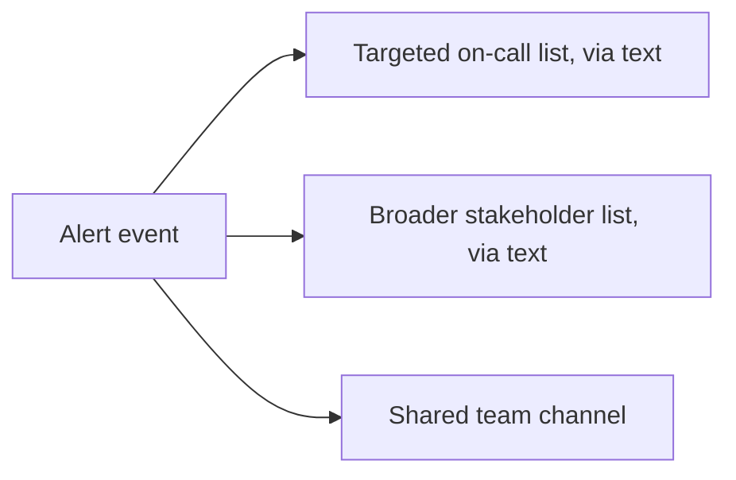

# Multi-channel, multi-audience fan-out

**The idea:** one alerting event should reach more than one audience over
more than one channel, and each audience/channel pairing is its own
independently configurable list — not a single "notify everyone the same
way" step.

## Why separate lists instead of one

A narrow on-call list needs the alert immediately, regardless of time or
noise tolerance — they're the ones expected to act. A broader stakeholder
list cares about the same event but doesn't need the same channel or
urgency. And a shared team channel serves as a visible, persistent record
of what happened, useful to anyone glancing at it later, not just whoever
was paged. Collapsing all three into one audience and one channel would
either under-alert the people who need to act or over-alert everyone
else.

## Design principles

- **Recipients are data, not code.** Each list is a configuration value,
  not a hardcoded contact — the whole notification behavior can be
  retargeted without touching the workflow logic.
- **Channels run independently.** One channel failing, or being
  intentionally suppressed (see
  [channel-specific quiet hours](./channel-specific-quiet-hours.md)),
  never blocks another from firing.
- **The same fan-out shape triggers on both the initial alert and its
  resolution** — see
  [self-resolving alert loop](./self-resolving-alert-loop.md) — so
  recipients get symmetric visibility into a problem opening and closing.
