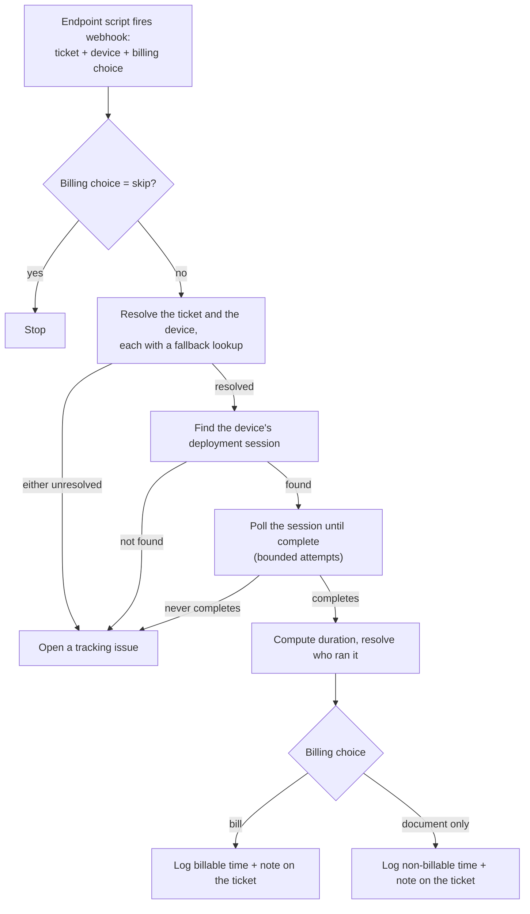

# Deployment Time Logging

Closes the loop between an endpoint management platform and the
ticketing system: when an automated device deployment finishes, the
device itself triggers an automation that finds out how long the work
actually took and logs it back on the ticket that asked for it — without
a technician having to remember to go check.

## The problem

Automated device onboarding runs unattended, often well after whoever
requested it stopped watching. That's the point — but it also means
nobody's there at the moment it finishes to log how long it took or
leave a note on the originating ticket. Left manual, that step either
gets forgotten (time worked goes untracked) or gets batched up and
guessed at later, well after the actual duration is easy to reconstruct
accurately.

## What it does

- **The endpoint triggers the automation, not the other way around** — a
  small script running at the very end of the deployment fires a webhook
  carrying just the originating ticket, the device's identity, and a
  billing choice. Nothing has to poll the endpoint platform waiting for
  work to finish; the device announces it.
- **Both the ticket and the device get resolved with a fallback** — the
  ticket is looked up as one of two possible ticket types, trying the
  other type if the first guess is wrong; the device is looked up by a
  hardware identifier first and by name if that comes up empty. See
  [concepts/dual-fallback-identity-resolution.md](./concepts/dual-fallback-identity-resolution.md).
- **The automation waits for the real session to actually finish** —
  rather than trusting the webhook's timing, it finds the device's
  matching deployment session on the endpoint platform and polls it on a
  bounded interval until the platform itself reports completion, so the
  logged duration reflects real elapsed time. See
  [concepts/poll-until-session-completes.md](./concepts/poll-until-session-completes.md).
- **How the time gets logged is a choice, made at the edge** — the
  triggering script picks whether the time should be billed, logged
  without billing, or not logged at all, and can supply an explicit
  duration instead of trusting the computed one. See
  [concepts/configurable-time-disposition.md](./concepts/configurable-time-disposition.md).
- **A stuck run opens a tracking issue instead of failing silently** —
  a device or session that can't be found, or a status check that never
  resolves after its bounded retries, opens a tracking issue describing
  what's suspected (an outage on one platform or the other) so a stalled
  run gets a human's attention instead of just disappearing.

## How it flows

