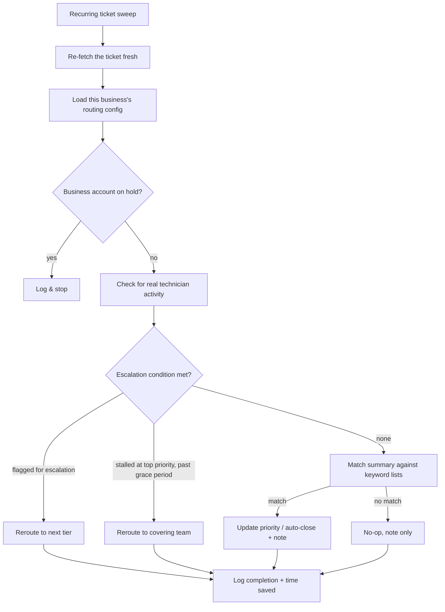

# NOC Ticket Routing

A recurring automation that triages helpdesk tickets across a portfolio of
managed businesses — setting priority from the ticket's own text, watching
for tickets nobody has picked up, and escalating the ones that are
stalling — without a human having to eyeball every ticket on every shift.

## The problem

A NOC (network operations center) team's helpdesk fills with tickets whose
correct priority isn't always obvious from where they land — a summary
might describe something urgent even though it was filed at a routine
priority, or vice versa. Left alone, that means either a human scans every
new and aging ticket by hand to catch the ones that need re-prioritizing
or escalating, or urgent tickets sit at the wrong priority until someone
happens to notice. Neither scales across many managed businesses and many
shifts.

## What it does

- **Config-driven, per-org setup** — a short setup form captures how
  *this* business's helpdesk is organized (which boards, which priority
  tiers, which statuses mean "open" vs "in progress" vs "needs
  escalation") and saves it as one routing config, so the same triage
  logic runs against every managed business without hardcoding anything
  business-specific. See
  [concepts/config-driven-multi-org-setup.md](./concepts/config-driven-multi-org-setup.md).
- **Keyword-based priority routing** — on a recurring sweep, each ticket's
  summary is checked against configurable keyword lists for each priority
  tier; a match updates the ticket's priority (or closes it outright, for
  patterns known to need no real work) and leaves an internal note
  explaining why. See
  [concepts/keyword-priority-routing.md](./concepts/keyword-priority-routing.md).
- **Human-activity-aware escalation** — before treating a ticket as
  "nobody's touched this," the automation checks the ticket's own history
  for real technician activity (filtering out its own automation
  account), so it only acts on tickets that are genuinely stalled. A
  ticket that's stalled at the highest priority, or that's already been
  flagged for escalation, gets automatically rerouted. See
  [concepts/human-activity-detection.md](./concepts/human-activity-detection.md).
- **Resilient, self-tracking runs** — lookups that can transiently fail
  retry with a short backoff instead of failing the whole sweep, and every
  run — whether it escalated a ticket, changed a priority, or found
  nothing to do — logs its own completion and time saved back to a
  reporting system, so the automation's effect stays visible instead of
  invisible.

## How it flows

Each new ticket is swept frequently at first, then on a wider interval as
it ages, until it closes or reaches an age where it's no longer
auto-swept — so a fresh ticket gets fast attention without every aging
ticket being re-checked forever.
