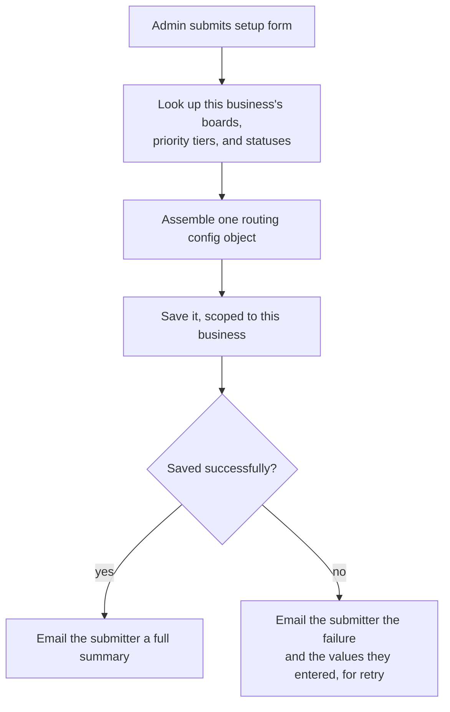

# Config-driven, multi-org setup

**The idea:** rather than hardcoding board IDs, priority tiers, or status
names into the automation itself, a one-time setup form captures how each
managed business's helpdesk is structured and saves it as a single
routing config, scoped to that business. Every recurring run reads the
config for whichever business owns the ticket it's looking at, so one
shared automation serves every managed business without a code change per
business.

## The setup flow

- **What gets captured:** which board tickets should route through, which
  board an escalation should land on, which priority tier maps to which
  meaning, and which statuses mean "open," "in progress," "needs
  escalation," or "closed" for *this* business's helpdesk setup.
- **Confirmation either way:** a successful save gets a readable summary
  of every value that was resolved (not just raw IDs) emailed back to
  whoever configured it; a failed save gets the submitted values back so
  they can be corrected and resubmitted, rather than the admin having to
  reconstruct what they typed.
- **A second, smaller setup path** exists for keyword lists (see
  [keyword-priority-routing.md](./keyword-priority-routing.md)) — the
  phrases that drive priority matching are themselves configurable data,
  not hardcoded strings, so they can be tuned per deployment without
  touching the automation.

## Why this shape

- **One automation, many businesses.** The triage logic is written once;
  what varies per business is entirely data, loaded at run time.
- **Config is human-reviewable, not just machine-readable.** The
  confirmation email resolves IDs back to their human names before
  presenting them, so a person can actually verify what they configured
  matches what they intended.
- **Failure is recoverable.** Because the failure path echoes back
  exactly what was submitted, a bad save doesn't force the admin to start
  the form over from scratch.
