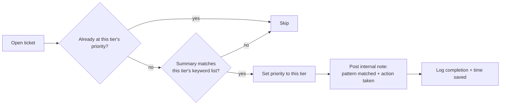

# Keyword-based priority routing

**The idea:** a ticket's summary text often signals urgency better than
whatever priority it was filed at. Rather than hardcoding a fixed list of
"urgent" phrases into the automation, each priority tier has its own
configurable list of keyword/phrase patterns (see
[config-driven-multi-org-setup.md](./config-driven-multi-org-setup.md)).
On each sweep, an open ticket that isn't already at a tier's priority gets
its summary checked against that tier's list; a match re-prioritizes it
and leaves a note recording which pattern triggered the change.

## The check, per tier

- Tiers are checked from most to least urgent, so a ticket matching more
  than one tier's pattern lands at the more urgent one.
- One pattern family is treated as "fully known" rather than merely
  urgent: a match there logs time against the ticket and closes it
  outright, on the reasoning that the pattern is well enough understood
  that no human review adds value.
- If nothing matches at any tier, the automation still leaves a note
  confirming it checked and took no action — so "the automation ran and
  decided this ticket needs no change" stays distinguishable from "the
  automation never looked at this ticket."

## Why this shape

- **The wording lives in data, not code.** Whoever owns the helpdesk can
  refine what counts as "sounds like an outage" without anyone touching
  the automation itself.
- **Every action is explainable.** Because the note records which pattern
  matched, a technician reviewing the ticket later can see exactly why
  the priority changed instead of just that it changed.
- **Idempotent by construction.** Skipping tickets already at a tier's
  priority means re-running the sweep against the same ticket repeatedly
  is harmless — it only acts on tickets that actually need a change.
