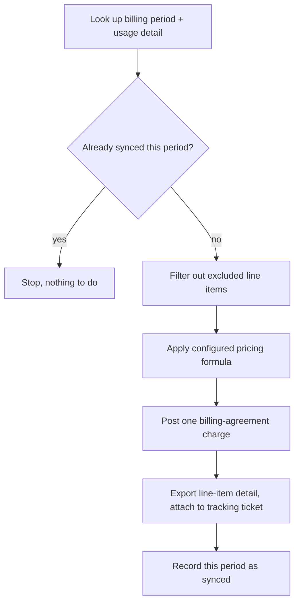

# Usage-Based Billing Sync

Turns a cloud provider's raw usage and invoice data into a single accurate
billing-agreement charge each period — without re-billing the same period
twice, and without losing the detail behind the number.

## The problem

Consumption-based cloud services don't bill a fixed seat count — the
charge changes every period based on what was actually used, and the
provider's own invoice is itemized far below the level a billing agreement
needs. Left manual, that means someone re-pulling an itemized invoice
every period, manually excluding anything that shouldn't be billed,
applying a pricing formula by hand, and hoping nobody re-runs the same
period's charge twice.

## What it does

- **Period-based idempotent sync** — before doing any work, the current
  billing period is compared against the last period this automation
  actually completed; a match means nothing more to do this run. See
  [concepts/period-based-idempotent-sync.md](./concepts/period-based-idempotent-sync.md).
- **Exclusion list filtering** — a configurable list of specific line
  items to leave out of billing (covered elsewhere, intentionally
  absorbed, etc.) is applied before any pricing math, so exceptions don't
  require touching the sync logic itself. See
  [concepts/exclusion-list-filtering.md](./concepts/exclusion-list-filtering.md).
- **Configurable cost-to-price translation** — the same raw usage cost
  becomes a billed price through one of two interchangeable formulas
  (target margin or flat markup), chosen per business by config. See
  [concepts/cost-to-price-translation.md](./concepts/cost-to-price-translation.md).
- **Traceable single-line billing** — the whole period's usage posts as
  one billing-agreement charge, but every line item behind that number is
  exported and attached to a tracking ticket, so the total stays
  auditable without re-querying the source. See
  [concepts/traceable-single-line-billing.md](./concepts/traceable-single-line-billing.md).
- **Bounded retry on transient failures** — every external lookup retries
  on increasing backoff up to a small cap before falling back to a
  failure path, the same principle documented in
  [NOC Ticket Routing](../noc-ticket-routing/concepts/human-activity-detection.md).

## How it flows

