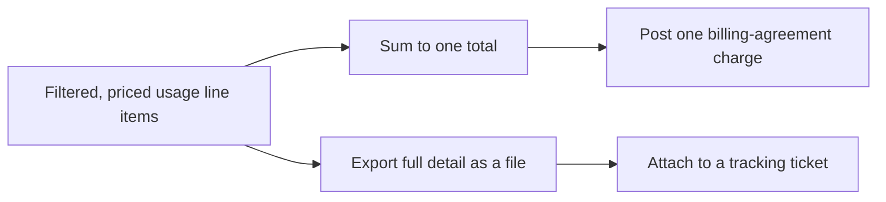

# Traceable single-line billing

**The idea:** a billing agreement wants one clean charge per period, not a
line for every underlying usage item — but "one number" shouldn't mean
"no way to check where it came from." The automation posts a single
charge, while separately exporting every line item that contributed to it
and attaching that detail to a tracking ticket.

## Why keep the detail even though the bill is one line

A billing agreement addition is meant to be readable at a glance — nobody
wants to scroll a dozen usage line items on an invoice. But when a
customer or a technician later asks "why is this number what it is,"
someone needs an answer that doesn't require re-querying the provider's
API from scratch. Keeping the export attached to a ticket makes that
answer a five-second lookup instead of a re-run of the automation.

## Design principles

- **The bill and the audit trail are separate artifacts, produced from
  the same data**, so simplifying what the customer sees doesn't mean
  losing what a technician might need later.
- **The detail is exported once, at sync time**, capturing exactly what
  was true when the charge was calculated — not reconstructed later from
  a system whose data may have since changed.
- **A tracking ticket is the anchor for that detail** — the same
  "one ticket per run, with the evidence attached" instinct as
  [Workforce-to-Directory Identity Sync](../../workforce-directory-sync/concepts/ticketed-batch-run.md),
  applied here to a financial total instead of a batch of user updates.
