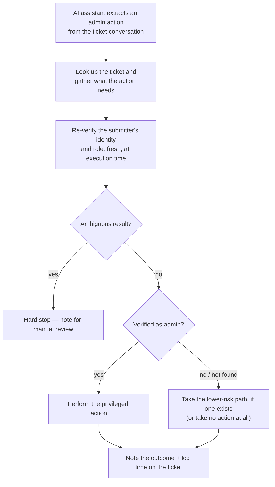

# AI-Assisted Admin Actions

Lets a conversational AI ticket-intake assistant carry out privileged
actions on an endpoint management platform — adding a user, merging or
retiring a tenant — while a zero-trust identity check, re-verified at the
moment of execution, decides what's actually allowed to happen.

## The problem

A conversational assistant is good at understanding *what* someone is
asking for from a support ticket, but "the assistant understood the
request" and "the requester is allowed to do this" are two different
questions. If the assistant's read of the ticket were treated as
authorization by itself, anyone who could word a ticket convincingly
would effectively have admin rights. The two have to stay separate: the
assistant extracts intent, and a dedicated check — run fresh, independent
of anything the ticket itself claims — decides whether the privileged
part of the action is actually allowed to run.

## What it does

- **One reusable identity check, called by every privileged action** —
  a shared building block takes an email address, resolves it against the
  platform's user directory, and reports back whether that person exists
  and whether their role includes admin/developer-level access. Every
  automation that can perform a privileged action calls the same check
  rather than each reimplementing its own notion of "is this person
  allowed." See
  [concepts/reusable-identity-verification.md](./concepts/reusable-identity-verification.md).
- **The gate sits at the point of privilege, not at the front door** —
  how strictly an action is blocked scales with what it actually does:
  a fully destructive action (merging or deleting a tenant) is blocked
  outright unless the check passes, while a lower-risk action (creating a
  baseline user record) can proceed either way — it's only the privileged
  *part* of that action (assigning an elevated permission group) that
  stays gated behind the same check. See
  [concepts/privilege-gated-execution.md](./concepts/privilege-gated-execution.md).
- **Ambiguity is treated as a reason to stop, not a coin flip** — if a
  lookup resolves to more than one matching account, or a request asks
  for more than one permission group at once, the automation refuses to
  guess which one was meant and hard-stops for a human to sort out. See
  [concepts/ambiguity-is-a-stop-condition.md](./concepts/ambiguity-is-a-stop-condition.md).
- **Every outcome leaves a note, not just the successful ones** — whether
  the action ran, was blocked for lack of admin verification, or hit an
  ambiguous state, the originating ticket gets a note explaining exactly
  what happened and what (if anything) still needs a human's attention.

## How it flows

