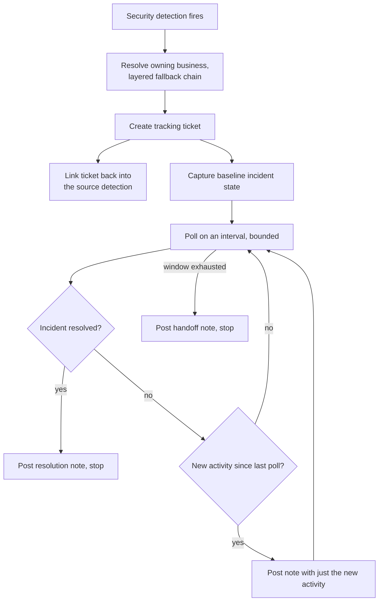

# Threat Detection Incident Tracking

Turns a security detection into a tracked incident automatically: a
ticket gets created, filed against the right business whenever possible,
linked back to the source detection, and kept updated with what's
happening — without a human having to babysit it minute to minute.

## The problem

A security detection firing is the start of an incident, not the whole of
it — someone still has to open a ticket, figure out which business it
belongs to, and keep checking back for updates until it's resolved. Doing
that by hand means detections either sit unactioned until someone
notices, or a technician keeps two consoles open just to relay updates
from the security tool to the ticketing system by hand.

## What it does

- **Layered ownership resolution, never a dead end** — the detection is
  routed to the right business through a chain of increasingly
  approximate lookups, and if every lookup comes up empty, it still lands
  somewhere — a default owner, loudly flagged for a human to correct —
  rather than going untracked because ownership couldn't be determined.
  See
  [concepts/layered-ownership-resolution.md](./concepts/layered-ownership-resolution.md).
- **Diff-based incremental polling** — rather than re-fetching and
  re-reporting the whole incident history every cycle, each poll surfaces
  only what's genuinely new since the last check, and stops altogether —
  with an explicit handoff note — once the incident resolves or a bounded
  time window elapses. See
  [concepts/diff-based-incremental-polling.md](./concepts/diff-based-incremental-polling.md).
- **Bidirectional system linking** — the ticket is written back into the
  source detection record, so either system can be used to jump straight
  to the other, instead of the relationship only being visible from one
  side. See
  [concepts/bidirectional-system-linking.md](./concepts/bidirectional-system-linking.md).

## How it flows

