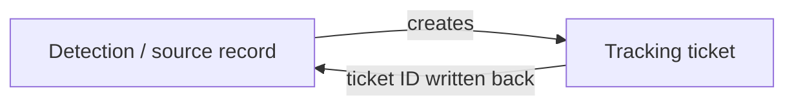

# Bidirectional system linking

**The idea:** once a tracking ticket is created from a detection, the
relationship between the two shouldn't only be visible from the ticket's
side. The ticket's identifier gets written back into the source record
too, so someone working from either system can jump straight to the
other.

## Why link both directions

A one-way reference only helps someone who already started in the
ticketing system. An analyst working directly in the detection tool —
which is often where the actual investigation happens — has no way to
find the related ticket without a separate search, unless the detection
record itself carries that reference. Writing it back closes that gap for
whichever system someone happens to be in first.

## Design principles

- **The backlink is best-effort, not blocking.** If writing the reference
  back to the source system fails, the ticket and the rest of the
  automation continue anyway — a missing backlink is a minor
  inconvenience, not a reason to stop tracking a live incident.
- **Each system keeps its own natural identifier.** Neither side has to
  adopt the other's ID scheme; each just stores a reference to the
  other's, which is enough for a person to navigate between them.
