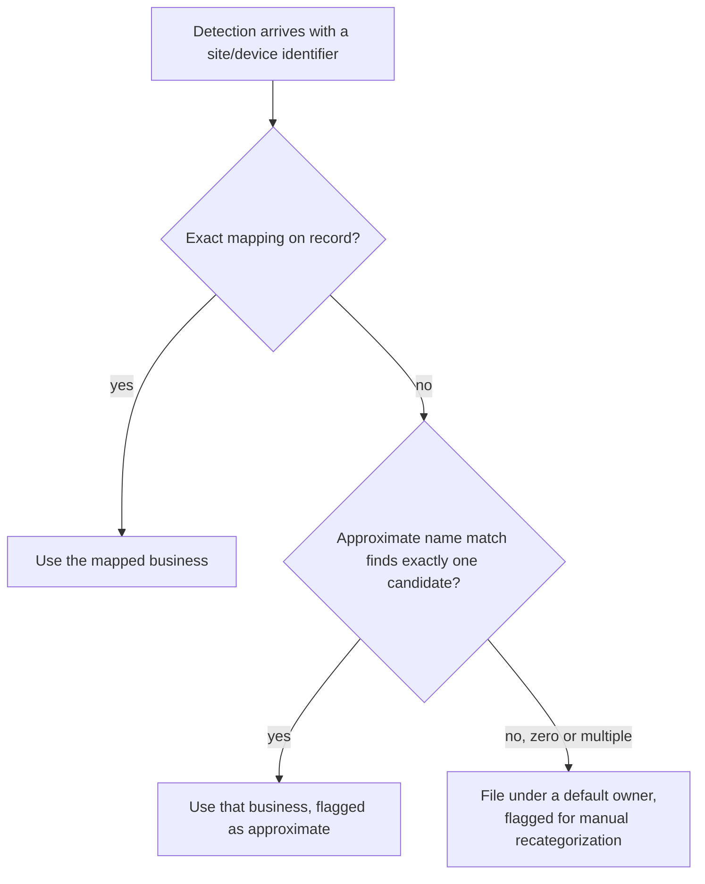

# Layered ownership resolution, never a dead end

**The idea:** figuring out which business a detection belongs to isn't
always a clean lookup, so the automation tries progressively less exact
methods before giving up — and even then, it doesn't give up. A detection
that can't be confidently routed still gets tracked, under a default
owner, with a loud flag that tells a human exactly what's uncertain and
what to fix.

## Why never let routing failure mean no ticket at all

An unrouted detection isn't a routing problem to solve later — it's a
live security incident that still needs a response right now. Filing it
under a known catch-all business, loudly flagged, guarantees it's tracked
and visible immediately; sorting out where it actually belongs becomes a
five-minute correction instead of the alternative, which is a detection
nobody's tracking at all because the automation couldn't decide where to
file it.

## Why layer the lookups instead of using one

An exact, pre-configured mapping is the most trustworthy signal when it
exists, but it isn't always available for every site — a business that's
recently onboarded or reconfigured might not have that mapping set yet.
Falling back to a name-based match covers that gap probabilistically, but
only when it's unambiguous; an approximate match returning zero or
multiple candidates is treated the same as no match at all, since a wrong
guess is worse than an honest "couldn't determine this."

## Design principles

- **Every tier that succeeds still says how confidently.** A ticket filed
  from an exact mapping looks different from one filed on a fuzzy match
  or a default, so whoever picks it up knows how much to trust the
  routing without having to dig.
- **The safety net is explicit, not silent.** The default path doesn't
  quietly guess — it says outright that recategorization is needed and
  what to configure to prevent it next time.
- **A deeper elaboration of the same instinct as [Deployment Time
  Logging](../../../service-delivery-operations/deployment-time-logging/concepts/dual-fallback-identity-resolution.md)'s
  fallback lookups** — the difference here is that even total failure
  still resolves to *something* actionable, rather than the automation
  stopping when identity can't be confidently determined.
